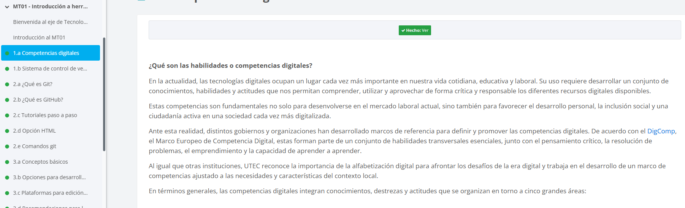
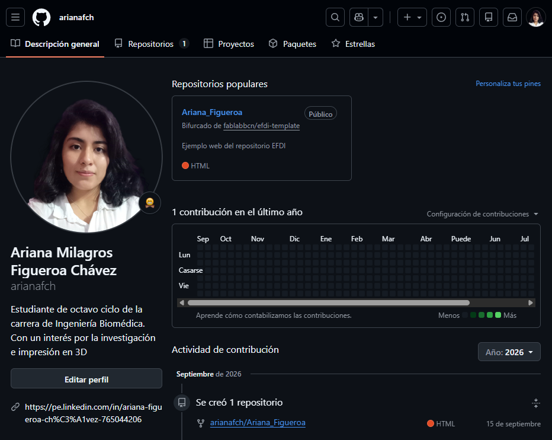
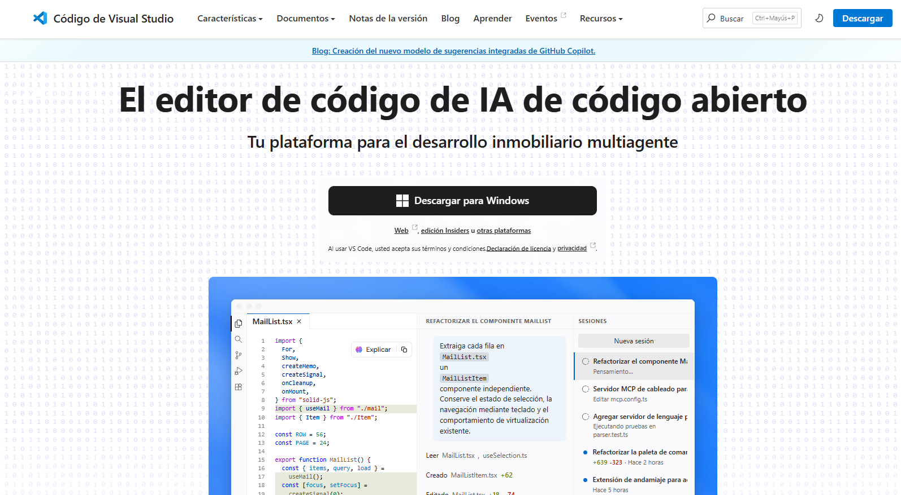
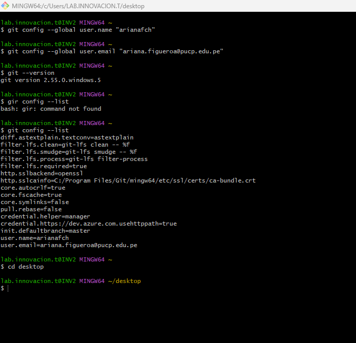
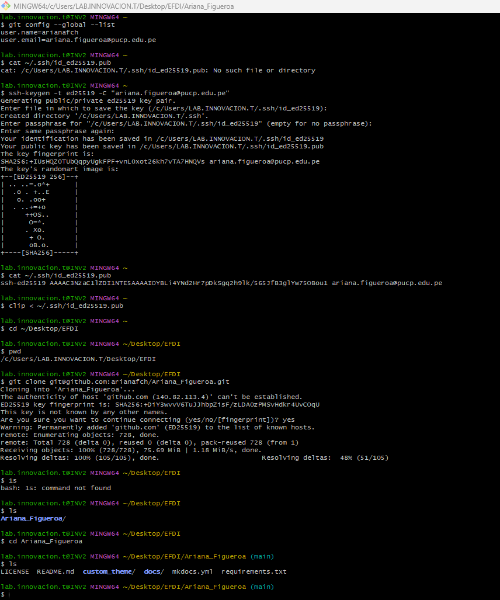

## **Mi primer paso: Reforzando conceptos básicos**

Lo primero que hice fue repasar los contenidos de las clases y revisar los recursos disponibles en Moodle, con el objetivo de reforzar mis conocimientos sobre los conceptos de sistemas de control de versiones, Git y GitHub.



## **Paso 2: Acceso a mi cuenta de GitHub**

Antes de comenzar con la instalación del editor de código, ingresé a GitHub para crear una cuenta. Sin embargo, me di cuenta de que ya tenía una cuenta vinculada a mi correo electrónico, pero no recordaba mi contraseña. Por ello, seguí los pasos para recuperarla y logré acceder nuevamente a mi cuenta de GitHub.



## **Paso 3: Instalación de Visual Studio Code**

Para el desarrollo web, se nos presentaron diversas opciones de editores de código. Opté por utilizar Visual Studio Code, ya que fue una de las herramientas recomendadas durante la clase. Por ello, procedí a descargar el programa y seguí los pasos correspondientes para su instalación.



## **Paso 4: Revisión del tutorial de Git y GitHub**

Revisé el tutorial proporcionado en clase, el cual me sirvió como guía para instalar y configurar Git, crear mi repositorio en GitHub y vincularlo con Visual Studio Code. Además, me permitió comprender cómo realizar modificaciones en mi página web desde mi computadora y subir los cambios a GitHub.

[Ver Documento](../../pdf/Tutorial_Git.pdf)

## **Paso 5: Uso de Git Bash para gestionar mi repositorio**

Utilicé Git Bash para ejecutar los comandos necesarios para configurar Git, vincular mi repositorio local con GitHub y gestionar los cambios realizados en mi página web. A través de esta herramienta, pude familiarizarme con los comandos básicos de Git y comprender cómo se registran y envían los cambios desde mi computadora hacia el repositorio remoto.

**Alguno comandos utilizados en Git Bash:**

```bash
git status
git config --list .
git config
git --version
git config --global user.name ""
git config --global user.email ""
```

Imágenes de referencia:





## **Paso 6: Edición y personalización de mi página web**

Una vez vinculadas las herramientas, comencé a editar los archivos de mi página web desde Visual Studio Code. Inicié con la personalización de las secciones «About Me» y «About Sitio Web», modificando los códigos para incorporar mi información personal, fotografías y contenido necesario.
