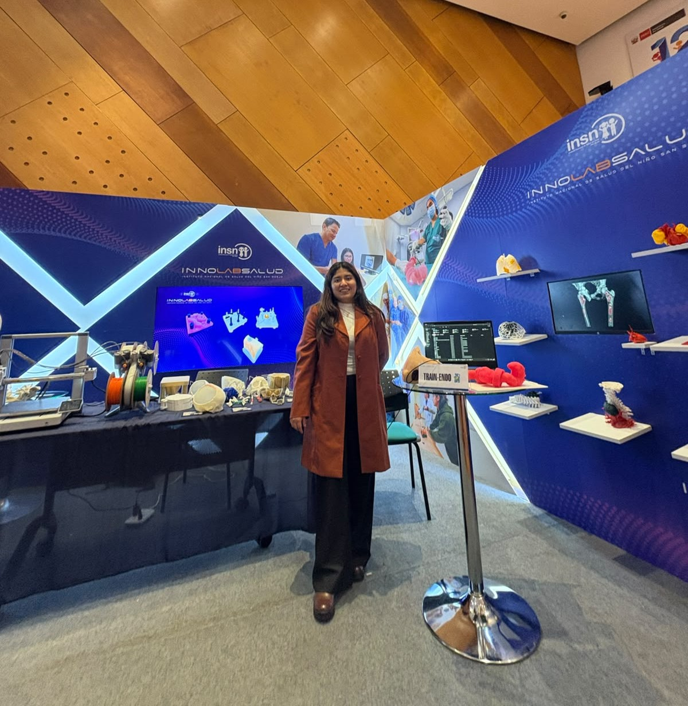

# Ariana Figueroa

Soy Ingeniera Biomédica, me apasiona la innovación tecnológica y el desarrollo de soluciones que contribuyan a mejorar la atención en salud. Me considero una persona creativa y motivada por generar un impacto positivo en la salud mediante el uso de tecnologías, como la impresión 3D, para mejorar la calidad de vida de las personas.

Me interesa especialmente la aplicación de la impresión 3D en la planificación quirúrgica, mediante el desarrollo de modelos anatómicos personalizados que faciliten la comprensión de estructuras complejas y apoyen la toma de decisiones médicas. Mi objetivo es seguir explorando nuevas tecnologías que permitan transformar ideas en soluciones innovadoras para el sector salud.